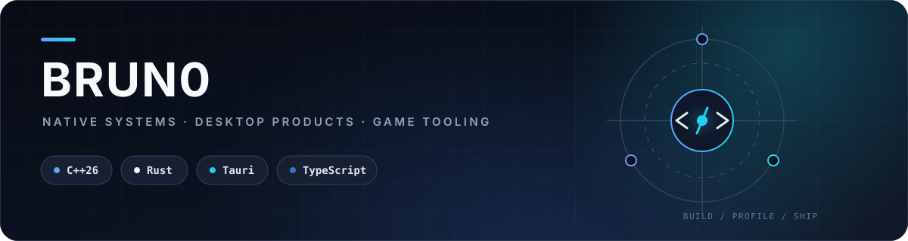

  

  <strong>Building fast, native software where systems programming meets product design.</strong>
   
  Performance-minded engineering · practical architecture · polished developer experience

 

  
  
  

## Engineering focus

- **Native systems** — modern C++26, low-level APIs and performance-sensitive software.
- **Safe performance** — Rust for reliable cores, tooling, concurrency and application infrastructure.
- **Desktop products** — Tauri applications with TypeScript frontends and native capabilities.
- **Game technology** — client extensions, modding frameworks and developer tools for game ecosystems.

## Core stack

  
  
  
  

## Selected work

- **[Codex Desktop Next](https://github.com/BRUN0R2/codex-app)** — a native Windows client built with Rust, Tauri, TypeScript and SolidJS.
- **[ReZombie](https://github.com/BRUN0R2/rezombie)** — a modern Zombie Plague experience for Counter-Strike 1.6 and GoldSource.

## GitHub activity

  
  

  Language statistics describe public repository composition, not proficiency.

